# Cloud Computing Final Project


# 📚 目錄
- [專案簡介](#專案簡介)
- [部署說明](#部署說明)
- [Azure功能介紹](#功能介紹)
- [程式碼說明](#程式碼說明)
- [成果展示](#成果展示)
- [附件](#附件)


## 專案簡介

本專案的核心目標，是建立一種能跨越語言與感官障礙的資訊傳遞方式，讓圖片不再只是視覺資訊的載體，而能被更多使用者理解、聆聽與互動，對於視障者、外語使用者或閱讀不便者而言，能幫助他們理解圖片中的文字內容。使用者可先上傳圖片網址，由系統自動辨識圖片，接著選取所需功能，並提供四種語言翻譯的選項，最後再透過語音合成的方式，將文字內容以語音播放。

## 部署說明

本文件詳細紀錄從 Azure 資源建立、Docker 容器建構、映像上傳到 ACR，再到容器實際執行的完整過程，適用於部署 AI 模型應用程式至雲端環境。

---

### 📁 1. 建立資源群組

建立資源群組 `[群組名稱]`，用於集中管理所有 AI 相關服務。

---

### 🤖 2. 建立圖口秀服務

建立以下圖口秀服務，並**確保定價層為 Free F0**：

- 🔍 圖像辨識（Computer Vision）
- 🌐 翻譯（Translator）
- 🗣️ 文字轉語音（Text-to-Speech）

---

### 🔑 3. 取得端點與金鑰

前往每個服務的 **金鑰與端點** 頁面，複製內容供程式使用。

📷 *範例圖：*

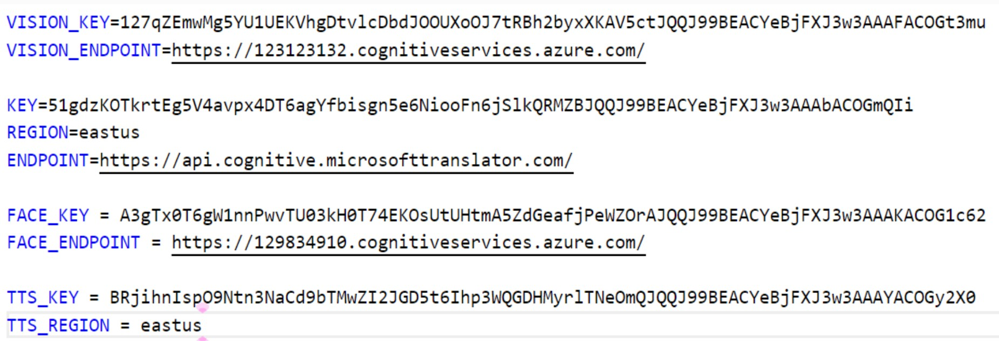


---

### 🐳 4. 建構 Docker 映像檔

在專案根目錄執行以下指令：

```bash
docker image build -t final:latest .
```

---

### 🖥️ 5. 執行本地容器

```bash
docker container run -d --name final -p 8080:8080 final:latest
```

可透過 `http://localhost:8080` 驗證是否執行成功。

---

### 📦 6. 創建一個資源群組

創建一個資源群組 final_project (用來存放我們的最終成果)

---

### 🏗️ 7. 創建 Azure Container Registry

於 Azure Portal 中創建 ACR（建議使用標準命名格式）

📷 *範例圖：*


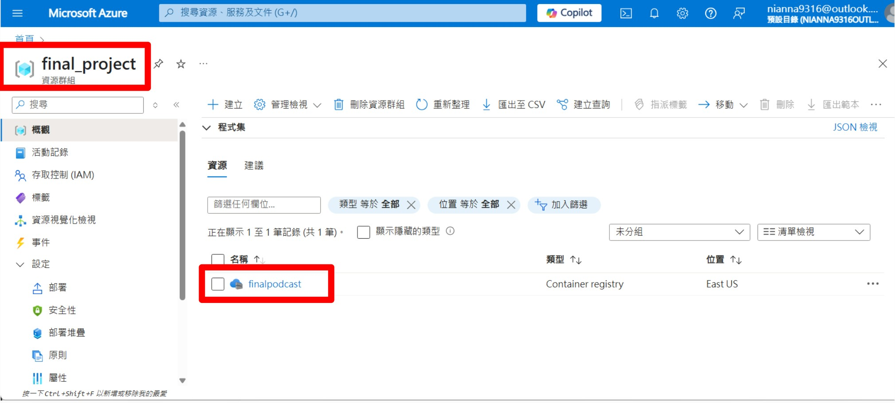

---

### 🔐 8. 啟用 Azure Container Registry 的管理使用者，取得金鑰

📷 *範例圖：*

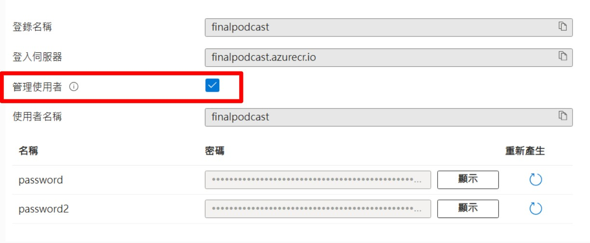

---

### 🔑 9. 登入 Azure Container Registry

```bash
docker login finalpodcast.azurecr.io
```

輸入以下帳密：

- Username: `finalpodcast`
- Password: `[password or password2]`

成功會顯示：

```bash
Login Succeeded
```

---

### 🛠️ 10. 建立自定義的映像檔

```bash
docker image build -t finalpodcast.azurecr.io/finalpodcast:latest .
```

---

### ☁️ 11. 將Docker映像檔上傳到 Azure Container Registry

```bash
docker image push finalpodcast.azurecr.io/finalpodcast:latest
```

---

### 🚀 12. 建立容器執行個體並使用 IP 存取

在 Azure Portal 建立容器執行個體（Container Instance），**指定公開連接埠為 8080**。

執行後請使用以下格式存取：

```
http://[公用 IP 位址]:8080
```

📷 *範例圖：*

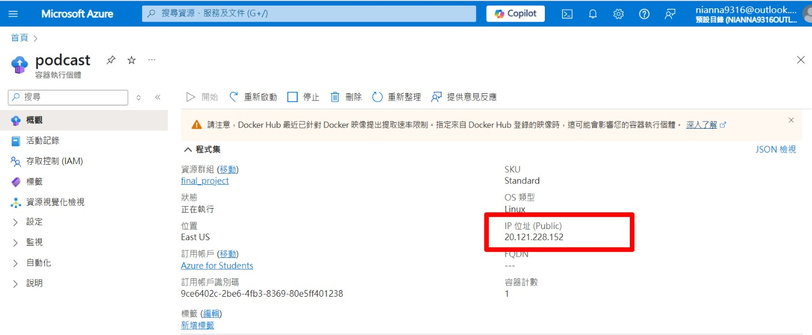

---

### ✅ 結語

你已成功將專案圖口秀部署至 Azure 平台，恭喜恭喜🎊


## 功能介紹

### 🎯 電腦視覺

<table>
  <tr>
    <td align="center">
      <strong>圖片描述</strong><br/>
      自動生成圖片的文字敘述，協助理解圖片內容。<br/>
      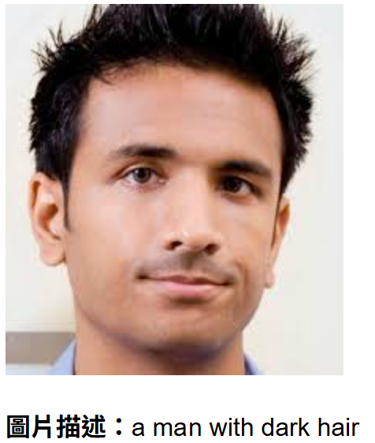
    </td>
    <td align="center">
      <strong>文字辨識（OCR）</strong><br/>
      擷取圖片中的文字資訊並輸出。<br/>
      
    </td>
  </tr>
  <tr>
    <td align="center">
      <strong>物件偵測</strong><br/>
      辨識圖片中出現的各種物件和可信度。<br/>
      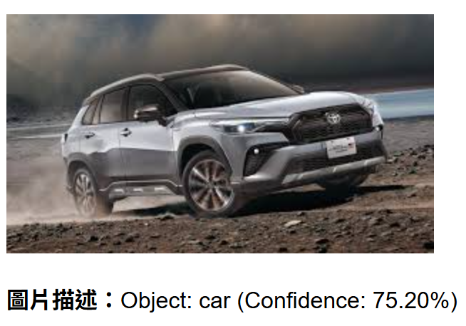
    </td>
    <td align="center">
      <strong>人臉偵測</strong><br/>
      辨識是否有配件、眼鏡及圖片的模糊程度。<br/>
      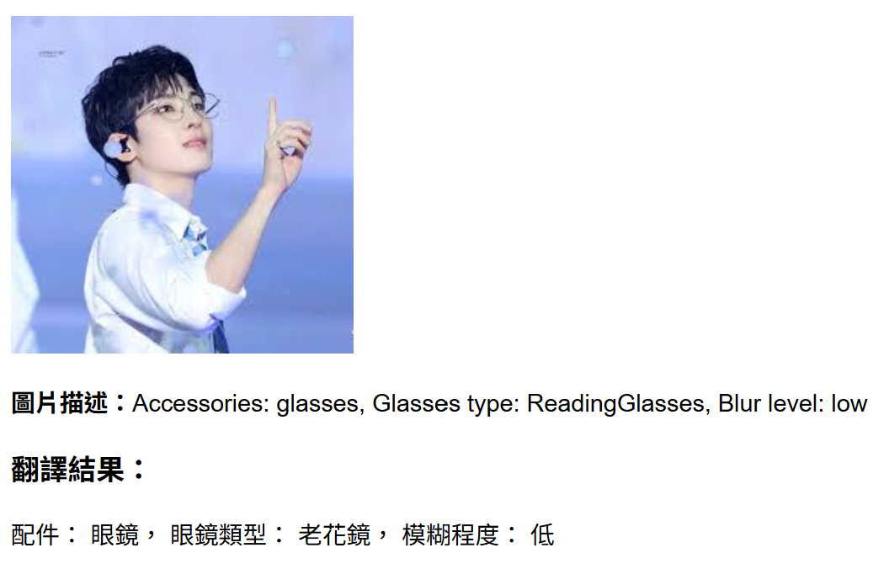
    </td>
  </tr>
</table>

---

### 🌐 翻譯工具

<table>
  <tr>
    <td align="center" colspan="2">
      支援多種語言的翻譯功能，使用者可自訂目標語言，系統將自動翻譯輸入內容。<br/>
      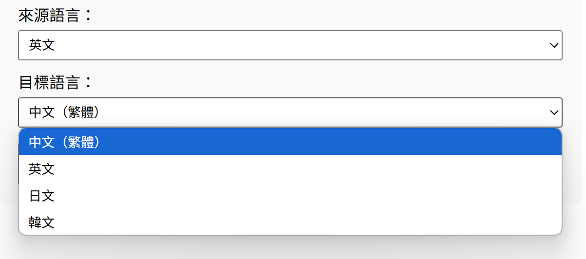
      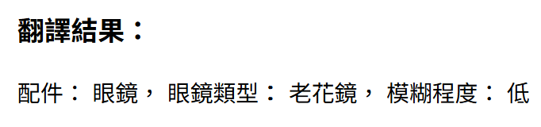
    </td>
  </tr>
</table>

---

### 🔊 文字轉語音

<table>
  <tr>
    <td align="center" colspan="2">
      將翻譯後的文字轉換為語音並播放，提升使用者的互動體驗。<br/>
      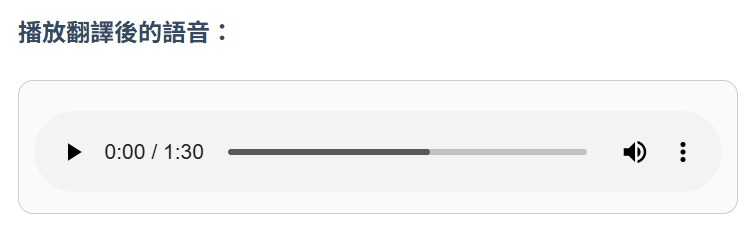
    </td>
  </tr>
</table>


## 程式碼說明

### 🔧 圖片描述功能
輸入圖片的 URL，使用影像辨識服務產生圖片的描述文字。  
如果成功取得描述，回傳第一個描述文字；如果無法產生描述，回傳「未能產生描述」。  
若發生錯誤（例如圖片無法讀取），則回傳「無法讀取圖片，請換一張」的錯誤訊息。

<pre> ```python
def get_image_description(image_url):
    try:
        description_result = vision_client.describe_image(image_url)
        if description_result.captions:
            return description_result.captions[0].text
        return "未能產生描述"
    except Exception as e:
        return "無法讀取圖片，請換一張"
'''</pre>

### 🔧 文字辨識功能
這段程式碼的功能是：  
輸入圖片的 URL，透過 OCR（光學字元辨識）技術擷取圖片中的文字內容。  
程式會先發送 OCR 請求，等待一段時間讓系統處理，然後取得分析結果。  
若成功辨識，會回傳圖片中偵測到的所有文字；若未偵測到文字或分析失敗，則回傳對應的英文提示訊息。  
若發生錯誤（例如圖片無法讀取），會回傳中文錯誤訊息「無法讀取圖片，請換一張」。

<pre> ```python
def get_image_text(image_url):
    try:
        # 執行 OCR 分析
        operation = vision_client.read(image_url, raw=True)
        operation_id = operation.headers["Operation-Location"].split("/")[-1]

        # 等待處理完成
        time.sleep(5)  # 延遲以確保結果準備好

        result = vision_client.get_read_result(operation_id)
        if result.status == "succeeded":
            text = " ".join([line.text for read_result in result.analyze_result.read_results for line in read_result.lines])
            return text if text else "No text detected"  # 改為英文
        return "OCR analysis was not successful"  # 改為英文
    except Exception as e:
        return "無法讀取圖片，請換一張"
'''</pre>

### 🔧 物件偵測功能
這段程式碼的功能是：  
輸入圖片的 URL，透過 Azure Computer Vision API 執行物件偵測，分析圖片中出現的物件。  
程式會回傳每個物件的名稱與信心度（confidence），並以英文格式呈現，例如："Object: car (Confidence: 95.00%)"。  
若圖片中未偵測到任何物件，則回傳英文訊息 "No objects detected"。  
若發生錯誤（例如圖片無法讀取），會回傳中文錯誤訊息「無法讀取圖片，請換一張」。


<pre> ```python
def get_detected_objects(image_url):
    try:
        # 呼叫 Azure Computer Vision API 進行物件偵測
        objects_result = vision_client.analyze_image(image_url, visual_features=["Objects"])
        
        # 取得所有偵測到的物件
        detected_objects = [
            # 將物件描述改為英文，以便後續翻譯
            f"Object: {obj.object_property} (Confidence: {obj.confidence:.2%})"
            for obj in objects_result.objects
        ]
        
        # 回傳結果或提示無偵測到物件
        return "； ".join(detected_objects) if detected_objects else "No objects detected" # 將多個物件描述用 "； " 連接，並將無物件提示改為英文
    
    except Exception as e:
        return "無法讀取圖片，請換一張"
'''</pre>

### 🔧 人臉偵測功能

1. 輸入圖片 URL。
2. 呼叫 Face API 的 `/detect` 端點，並要求回傳人臉屬性（如 glasses、blur 等）。
3. 若成功偵測到人臉，則回傳每張臉的屬性摘要：
   - 配件（Accessories）
   - 眼鏡類型（Glasses type）
   - 模糊程度（Blur level）
4. 若無偵測到人臉，回傳提示：`⚠️ 未偵測到人臉`
5. 若發生錯誤，回傳訊息：`無法讀取圖片，請換一張`

<pre> ```python
def get_detected_faces(image_url):
    """ 使用 Azure Face API 偵測人臉屬性 """
    try:
        # 設定 API URL
        url = f"{FACE_ENDPOINT}/face/v1.0/detect"

        # 設定請求參數（移除已棄用屬性）
        params = {
            "returnFaceAttributes": "headPose,glasses,occlusion,accessories,blur,exposure,noise",
            "recognitionModel": "recognition_04",
            "returnRecognitionModel": "true",
            "detectionModel": "detection_01"
        }

        # 設定請求標頭
        headers = {
            "Ocp-Apim-Subscription-Key": FACE_KEY,
            "Content-Type": "application/json"
        }

        # 設定請求主體
        data = {"url": image_url}

        # 送出 POST 請求
        response = requests.post(url, params=params, headers=headers, json=data)

        # 確保 API 回應成功
        if response.status_code != 200:
            return f"⚠️ 失敗，請換一張圖片"

        # 解析 API 回應
        faces_result = response.json()

        # 如果沒有偵測到人臉
        if not faces_result:
            return "⚠️ 未偵測到人臉"

        # 提取人臉屬性資訊
        faces_detected = [
            f"Accessories: {', '.join([acc['type'] for acc in face['faceAttributes'].get('accessories', [])]) if face['faceAttributes'].get('accessories') else 'None'}, "
            f"Glasses type: {face['faceAttributes'].get('glasses', 'Unknown')}, "
            f"Blur level: {face['faceAttributes'].get('blur', {}).get('blurLevel', 'Unknown')}"
            for face in faces_result
        ]

        return "； ".join(faces_detected)

    except Exception as e:
        return "無法讀取圖片，請換一張"
'''</pre>


### 🔧 語音功能
  
輸入原始文字 (`text`)、來源語言代碼 (`src_language`) 和目標語言代碼 (`dst_language`)，  
透過翻譯服務將文字從來源語言翻譯成目標語言，並回傳翻譯後的結果文字。  
如果翻譯過程中發生錯誤，則回傳錯誤訊息。

<pre> ```python

def translate_text(text, src_language, dst_language):
    try:
        targets = [InputTextItem(text=text)]
        responses = translator_client.translate(
            content=targets,
            to=[dst_language],
            from_parameter=src_language
        )
        return responses[0].translations[0].text
    except Exception as e:
        return f"翻譯時發生錯誤：{e}"
'''</pre>

### 🔧 翻譯功能

**輸入：**  
一段文字 (`text_to_speak`) 和語言代碼（如 `"en"`、`"zh-Hant"` 等）。

**處理流程：**

1. 檢查環境變數 `TTS_KEY` 和 `TTS_REGION` 是否有設定。  
2. 根據輸入的語言代碼，選擇對應的語音設定（如中文就用 HsiaoChen 的聲音）。  
3. 使用 SSML 格式包裝語音內容。  
4. 發送 POST 請求給 Azure TTS API，取得語音檔（二進位 MP3 音訊）。  

**輸出：**  
語音檔案的二進位資料（MP3 格式），或失敗時回傳 `None`。


<pre> ```python
def azure_text_to_speech(text_to_speak, target_lang_code_from_form):
    """
    Generates speech from text using Azure TTS.
    target_lang_code_from_form: Language code like "en", "zh-Hant", "ja", etc.
    """
    # 確認語音合成服務的金鑰與區域是否存在
    if not TTS_KEY or not TTS_REGION:
        print("Error: TTS_KEY or TTS_REGION environment variables not set.")
        return None
    # 如果輸入的文字是空的，無法合成，直接返回 None
    if not text_to_speak:
        print("Error: Text to speak is empty.")
        return None

    # 根據區域組合出 Azure TTS 服務的 API endpoint
    endpoint = f"https://{TTS_REGION}.tts.speech.microsoft.com/cognitiveservices/v1"
    headers = {
        "Ocp-Apim-Subscription-Key": TTS_KEY,# 認證的金鑰
        "Content-Type": "application/ssml+xml", # SSML（語音合成標記語言）格式
        "X-Microsoft-OutputFormat": "audio-16khz-32kbitrate-mono-mp3",# 指定輸出音訊格式為 16kHz、32kbps、單聲道 mp3
        "User-Agent": "python-requests" # 用於標示請求端
    }
    # SSML:Speech Synthesis Markup Language（語音合成標記語言)，用來控制文字轉語音（TTS）時的語音合成效果。
    # 根據使用者傳入的語言代碼，對應 Azure SSML 所需的語言標籤與聲音名稱
    lang_voice_map = {
        "en": ("en-US", "en-US-JennyNeural"),
        "zh-Hans": ("zh-CN", "zh-CN-XiaoxiaoNeural"),
        "zh-Hant": ("zh-TW", "zh-TW-HsiaoChenNeural"),
        "ja": ("ja-JP", "ja-JP-NanamiNeural"),
        "ko": ("ko-KR", "ko-KR-SunHiNeural"),
    }
    # 如果找不到匹配，使用英文語音作為預設
    default_ssml_lang = "en-US" 
    default_ssml_voice = "en-US-JennyNeural"

    ssml_lang, ssml_voice_name = lang_voice_map.get(target_lang_code_from_form, (default_ssml_lang, default_ssml_voice))

    # 使用 SSML 格式來描述語音合成的內容
    ssml = f"""
    <speak version='1.0' xml:lang='{ssml_lang}'>
        <voice xml:lang='{ssml_lang}' name='{ssml_voice_name}'>
            {text_to_speak}
        </voice>
    </speak>
    """

    # 發送 HTTP POST 請求並處理回應
    try:
        response = requests.post(endpoint, headers=headers, data=ssml.encode("utf-8"))
        response.raise_for_status() # Will raise an HTTPError for bad status codes
        return response.content
    except requests.exceptions.RequestException as e:
        print(f"Speech synthesis API error: {e}")
        return None
``` </pre>


## 成果展示

<table align="center">
  <tr>
    <td align="center">
      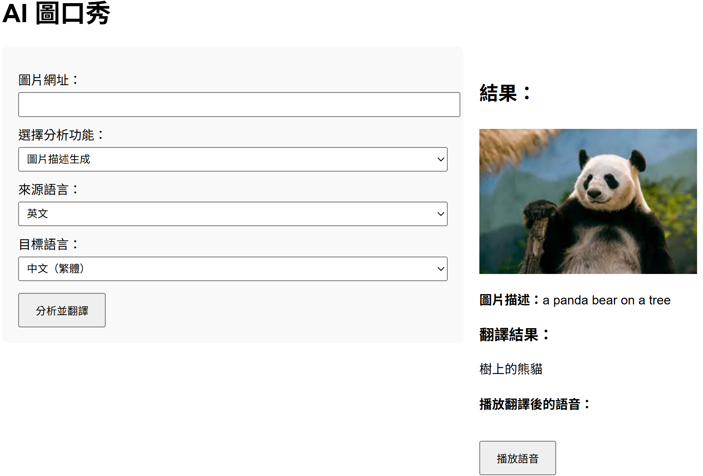<br/>
      <sub>圖片描述</sub>
    </td>
    <td align="center">
      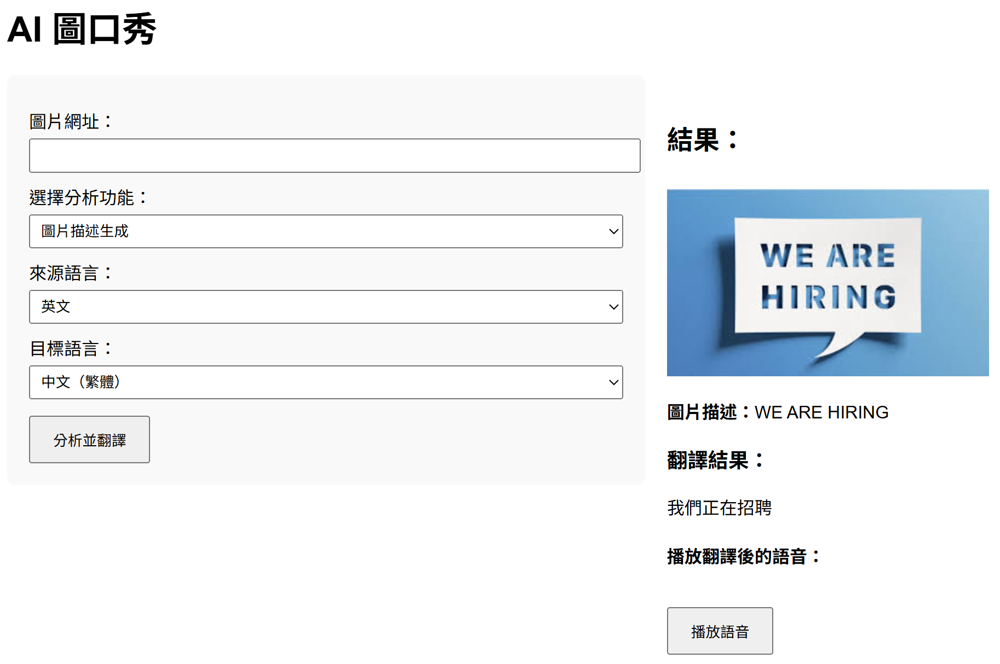<br/>
      <sub>文字辨識</sub>
    </td>
  </tr>
  <tr>
    <td align="center">
      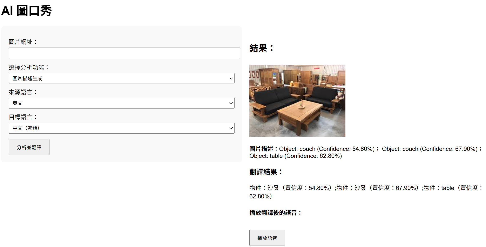<br/>
      <sub>物件偵測</sub>
    </td>
    <td align="center">
      <br/>
      <sub>人臉偵測</sub>
    </td>
  </tr>
</table>

## 附件 
圖片範例連結
### 🖼️ 圖片描述  
`https://encrypted-tbn0.gstatic.com/images?q=tbn:ANd9GcQtYy6_wCdBjxSs_ZpG2FWGgGxWubtDxupgPA&s`
`https://encrypted-tbn0.gstatic.com/images?q=tbn:ANd9GcR4rAonJ7WjvZZojimTo6UdcOw6-vii2wyUYw&s`

### 📝 文字辨識  
`https://encrypted-tbn0.gstatic.com/images?q=tbn:ANd9GcTVCtQwEOsKS7QJ23IyTQNFHAZhd2_DdXRnDA&s`
`https://encrypted-tbn0.gstatic.com/images?q=tbn:ANd9GcSiNu7XAJmHJ5m2qAOtX6J6MhVrPpEFom8EVw&s`

### 🎯 物件偵測  
`https://encrypted-tbn0.gstatic.com/images?q=tbn:ANd9GcQpty5AGIaqoSLQTXCbHvs_rJO7qhqV_rDnVA&s`  
`https://encrypted-tbn0.gstatic.com/images?q=tbn:ANd9GcTTJOhJO9VFuvgXdxvIMACkQPdLuehOLVPP4w&s`

### 😃 人臉偵測  
`https://encrypted-tbn0.gstatic.com/images?q=tbn:ANd9GcTBp5NG3HYScSyX2cenBc6ESJM2lre64u_b-g&s`  
`https://encrypted-tbn0.gstatic.com/images?q=tbn:ANd9GcRmUM00SbkglBg3m5hYWVLr8dO4eIKX0Thr-Q&s`
